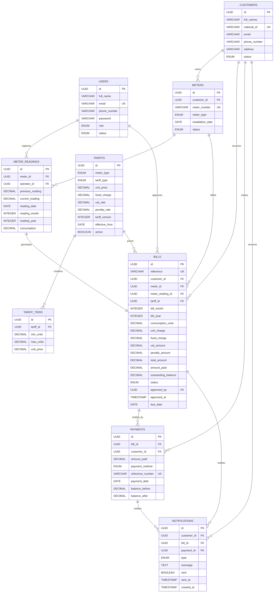
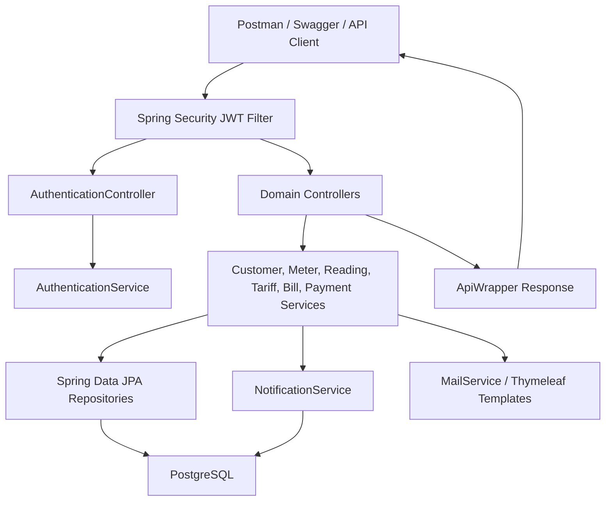

# Utility Billing System Design

This document captures the backend deliverables for the WASAC/REG utility billing exam implementation.

## ERD

The implementation follows the supplied database architecture and maps it to PostgreSQL-friendly JPA entities.

## Spring Boot Flow

## Main API Groups

- `POST /api/v1/auth/register`: customer signup. New users are active `CUSTOMER` users by default.
- `POST /api/v1/auth/authenticate`: login and JWT issuance.
- `POST /api/v1/auth/change-password`, `/forgot-password`, `/reset-password`, `/refresh-token`, `/logout`: authentication support.
- `GET /api/v1/users`, `POST /api/v1/users`, `PATCH /api/v1/users/{id}/status`: admin user management.
- `CRUD /api/v1/customers`: customer management.
- `CRUD /api/v1/meters`: meter management.
- `POST /api/v1/meter-readings`: operator/admin reading capture.
- `POST /api/v1/tariffs`: admin tariff configuration with versioning and future-cycle enforcement.
- `POST /api/v1/bills/generate`: finance/admin bill generation from meter readings.
- `POST /api/v1/bills/{id}/approve`: finance/admin bill approval.
- `POST /api/v1/payments`: finance/admin partial or full payment recording.
- `GET /api/v1/notifications`: notification inspection.

## Business Rules Implemented

- Duplicate users by email, customers by national ID, and meters by meter number are rejected.
- Inactive customers cannot receive meters or bills.
- Meter readings require active meters and active customers.
- Current reading must be greater than previous reading.
- Only one reading per meter per month/year is allowed.
- Tariffs are versioned per meter type.
- Tariffs must start no earlier than the next billing cycle.
- Flat tariffs use `unitPrice`; tiered tariffs require at least one tier.
- Bills are generated from readings, priced by the applicable tariff, and start as `PENDING_APPROVAL`.
- Bill generation creates a notification.
- Payments support partial and full settlement.
- Overpayments are rejected.
- Full payment marks the bill `PAID` and creates a customer notification.

## Security Model

- All endpoints are secured except `/api/v1/auth/**` and Swagger/OpenAPI resources.
- Method-level authorization uses:
  - `ADMIN`: configure tariffs, manage users/customers/meters, approve bills.
  - `OPERATOR`: capture meter readings.
  - `FINANCE`: approve bills and record payments.
  - `CUSTOMER`: view customer-related bills, payments, meters, and notifications.
- JWT tokens must be valid and present in the token store as not expired and not revoked.

## Swagger

Swagger UI is configured at:

- `/myApp/swagger-ui.html`
- `/myApp/v3/api-docs`
